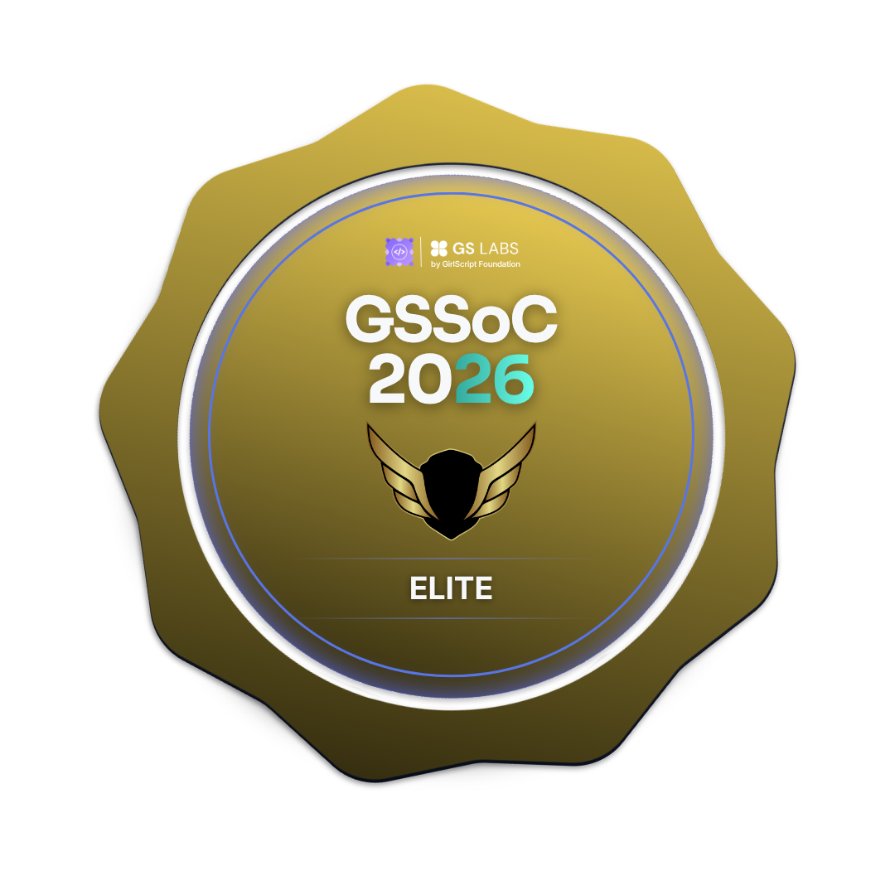

<h1 align="center">Hi 👋, I'm Jiya Singh</h1>

  

- 🌱 Currently leveling up in: probabilistic models, deep learning, and Explainable AI - learning to interrogate a model's answer before I trust it.
- 🤖 Building: [watchR-ai](https://github.com/jiya2401/watchR.ai) - an autonomous AI agent connecting LLMs, retrieval pipelines, and async workflows into systems that actually reason
- 💻 Full-stack? Yep - comfortable with the MERN stack, so I can ship the product around the model, not just the model itself
- 🎯 GSSoC'26 Contributor - figuring out open source workflows
- 💬 Ask me about: AI safety, Explainable AI, MERN stack, or my tea-to-debugging ratio ☕

## Languages and  Toolkit

  
  
  
  
  
  
  
  
  
  
  
  

 

 ---

 ## 🏆 GSSoC 2026 Achievements

  
  
  

  <a href="https://gssoc.girlscript.org/profile/ca03dd92-4914-440b-9c1f-144613b9abb0"><b>🔗 View full GSSoC profile</b></a>

---

> “Code is like humor. When you have to explain it, it’s bad.” – Cory House
